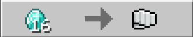
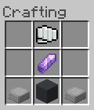

# **Broblock by Tako**(for 1.17)

## **How to Use:**

> Turn on Experimental Gameplay
>
> Right-Click the Broblock to pick it up (right-clicking while sneaking won't work)
>
> To Obtain the Broblock. You'll need to find a wandering trader to trade the fist item which you'll then craft into Broblock.

- _Broblock Crafting Recipe:_

  

  

### **Pack compatibility:**

**The add-on might not work with other packs that has configurations to the Wandering trader's trades(i.e Miniblocks by FoxyNoTail)**

There is a work around to this:

- **Copying your downloaded pack's trading contents into the Broblock behavior pack**

Chose an addon of your choice, for this example we'll be using Foxy's Miniblocks add-on, more on this [here](https://foxynotail.com/). Now, after you've downloaded your add-on, convert it to a `.zip` file by renaming the file extension `.mcpack/mcaddon`. Next is to extract its contents and look for `BP/trading/economy_trades/wandering_trader_trades.json#groups`, here's an example:

```json
{
  "tiers": [
    {
      "groups": [
        { //trades
        },
        { //trades
        }
      ]
    }
  ]
}
```

Copy the contents under `"groups": []` into `Broblock [B]/trading/economy_trades/wandering_trader_trades.json#groups`.

```json
{
  "tiers": [
    {
      "groups": [
        {
          "num_to_select": 5,
          "trades": [
            {
              "max_uses": 3,
              "wants": [
                {
                  "item": "minecraft:diamond",
                  "quantity": 16
                }
              ],
              "gives": [
                {
                  "item": "brocraft:fist_item"
                }
              ]
            }
          ]
        },
        {
          //your trades here
        }
      ]
    }
  ]
}
```

Convert the files into a .mcpack/mcaddon. Make sure that the Broblock pack is on top of the pack that you've configured, load it into Minecraft and tadah! You now have working trades for all the packs you want to use.
