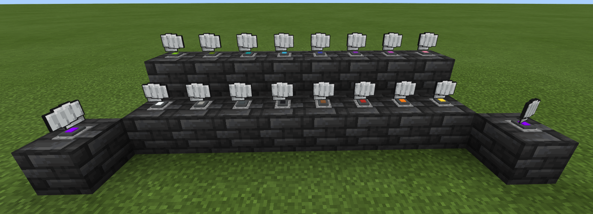

# **Broblock by Tako**(for 1.17)

## **How to Use:**

> **Make sure to turn on the following in your world setting under `Experiments`**
>  - **Holiday Creator Features**
>  - **Additional Modding Capabilities**
>  - **Upcoming Creator Features**
>
> Picking up the block requires you to right-click it, sneaking while doing so won't work.
>
> Obtaining the block:
> - Creative
>   - Using the commands, type in `/give @s brocraft:bblock`. *The block doesn't appear in the creative menu due to a reverted change*
> - Survival
>   - To obtain the block in Survival mode you'll first need to find a wandering trader that sells the **fist item** which you'll then craft into **Broblock** by in a 3x3 crafting grid with 1 Fist item, 1 Amethyst shard, 1 Gray concrete and 2 Smooth slabs. 
>   *Example:*
>   
> 
>
> 
>  
> - Dyeing
>   - You can dye the base color whilst holding a dye and right clicking the block.
>
> 

### **Pack compatibility:**

**The add-on might not work with other packs that has configurations to the Wandering trader's trades(i.e Miniblocks by FoxyNoTail)**

There is a work around to this:

- **Copying your downloaded pack's trading contents into the Broblock behavior pack**

Chose an addon of your choice, for this example we'll be using Foxy's Miniblocks add-on, more on this [here](https://foxynotail.com/). Now, after you've downloaded your add-on, convert it to a `.zip` file by renaming the file extension `.mcpack/mcaddon`. Next is to extract its contents and look for `BP/trading/economy_trades/wandering_trader_trades.json#groups`, here's an example:

```json
{
  "tiers": [
    {
      "groups": [
        { //trades
        },
        { //trades
        }
      ]
    }
  ]
}
```

Copy the contents under `"groups": []` into `Broblock [B]/trading/economy_trades/wandering_trader_trades.json#groups`.

```json
{
  "tiers": [
    {
      "groups": [
        {
          "num_to_select": 5,
          "trades": [
            {
              "max_uses": 3,
              "wants": [
                {
                  "item": "minecraft:diamond",
                  "quantity": 16
                }
              ],
              "gives": [
                {
                  "item": "brocraft:fist_item"
                }
              ]
            }
          ]
        },
        {
          //your trades here
        }
      ]
    }
  ]
}
```

Convert the files into a .mcpack/mcaddon. Make sure that the Broblock pack is on top of the pack that you've configured, load it into Minecraft and tadah! You now have working trades for all the packs you want to use.
